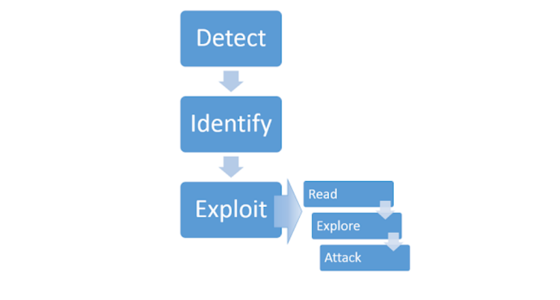
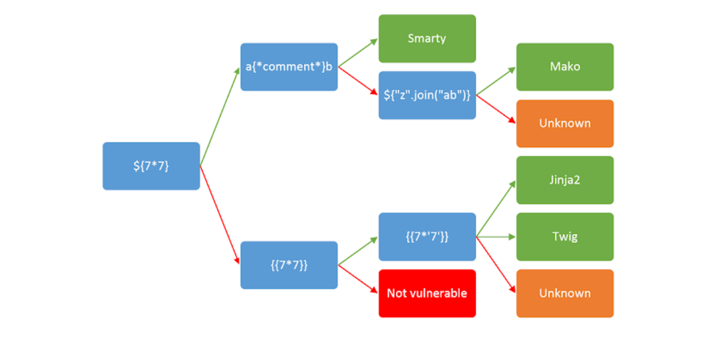

# Server Side Template Injection (SSTI)

# What is it ?

Server Side Template Injection (SSTI) is a server side vulnerability where an attacker is able to inject some malicious payload into the native template, which is then executed in the server-side.

They arise when user-supplied data is directly concatenated into the template, instead of passing them as data.

# Imapact of SSTI

- At the worst, SSTI can be used to achieve Remote Code Execution (RCE)
- It can also be used to read sensitive data and arbitrary files on the server.

# Constructing a SSTI attack



**DETECT**: 

- If we are able to detect the vulnerability, it becomes easy to exploit it.
- We can fuzz with a set of special characters that are commonly used in templating engines.
- Input value: `${{<%[%'"}}%\`
- If an exception is raised, there is a possibility that SSTI might be there.
- Regardless of the fuzzing output, we still need to consider the below contexts to detect a SSTI:
    - **Plaintext context**: setting mathematical operations as value of the paramter that we are testing for SSTI.
    - **Code context**: user-controllable variable name being placed in the parameter.

**IDENTIFY**:

- In this step, we identify the templating engine being used by the server.
- Putting an invalid template syntax in a parameter is a way that sometimes reveals the templating engine name and version.
- In other case we need to manually enter language specific payload to identify the templating engine.



# Preventive measures:

- Do not any user to modify or submit new template.
- Use a logic less template engine like Mustache.
- Use the templating engine in a sandboxed environment where most of the dangerous functions are not present.

# Exploiting a SSTI

- **READ**: Go through the documentation of identified templating engine
    - Learn the basic template syntax
    - Security documentation
    - Documented exploits
    
- **EXPLORE**: Explore the environment and try to discover all the objects to which we have access.
    - In most templating engine, there is a “self” or “environment” object that acts like a namespace that contains all objects methods and attributes that are supported by the engine.

- **DEVELOPER SUPPLIED OBJECTS**: Apart from the builtin objects of templating engine, there can also be custom site-specific objects that are created by the web developer.
    - These are likely to contain sensitive information or exploitable methods.
    - First, we need to understand how these objects are being used.
    
- **CREATE A CUSTOM EXPLOIT**: Sometimes we need to create custom exploits to exploit SSTI.
    - For example, when templates are executed inside a sandbox environment, it becomes hard or sometimes impossible to exploit SSTI.
    - By working methodically through our testing process, we may sometimes be able to create complex attacks that may even exploit more secure targets.
    - **Creating a custom object using an object chain**:
        - Identify the objects and methods to which we have access.
        - By combining that knowledge and documentation, we might be able to chain together an exploit.
    - **Creating a custom exploit using developer supplied objects**:
        - Unlike builtin objects, developer created objects does not have documentation at all.
        - We need to manually test the website to create the custom exploit.

# Handlebars code injection

```jsx
{{#with "s" as |string|}}
  {{#with "e"}}
    {{#with split as |conslist|}}
      {{this.pop}}
      {{this.push (lookup string.sub "constructor")}}
      {{this.pop}}
      {{#with string.split as |codelist|}}
        {{this.pop}}
        {{this.push "return JSON.stringify(process.env);"}}
        {{this.pop}}
        {{#each conslist}}
          {{#with (string.sub.apply 0 codelist)}}
            {{this}}
          {{/with}}
        {{/each}}
      {{/with}}
    {{/with}}
  {{/with}}
{{/with}}
```

# REFERENCES

- [PayloadAllTheThings](https://github.com/swisskyrepo/PayloadsAllTheThings/tree/master/Server)
- [https://mahmoudsec.blogspot.com/2019/04/handlebars-template-injection-and-rce.html](https://mahmoudsec.blogspot.com/2019/04/handlebars-template-injection-and-rce.html)
